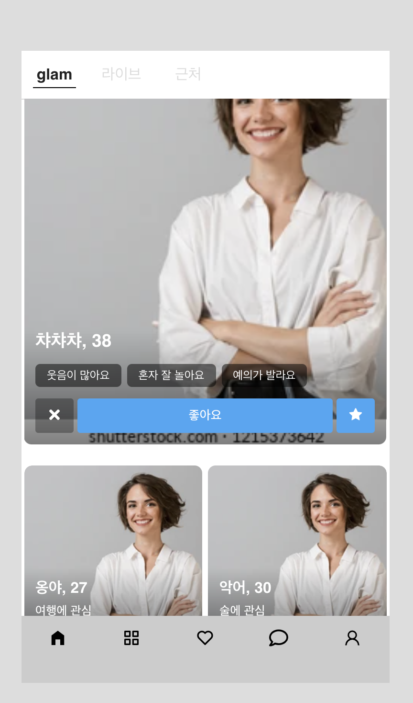
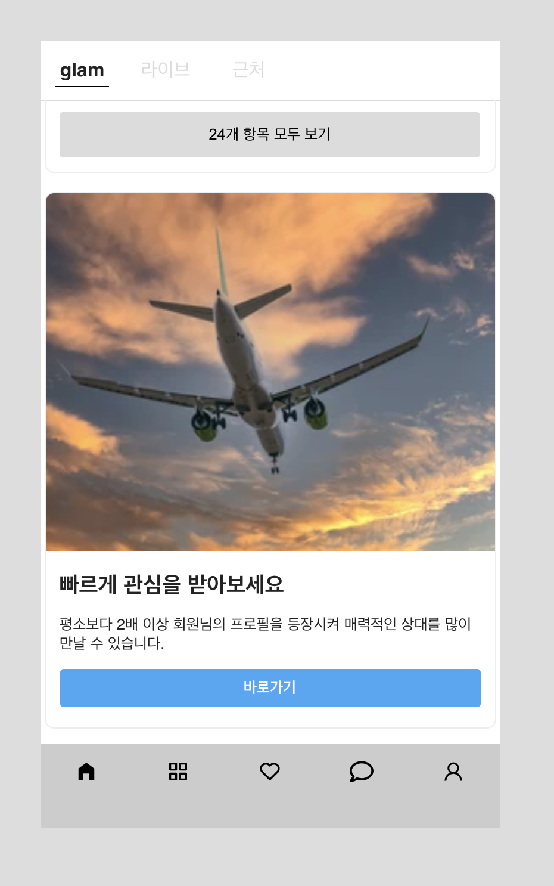
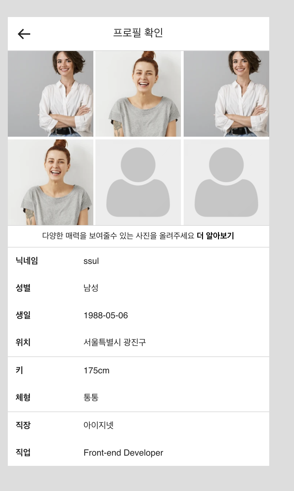

# Cupist 입사 과제

## 코드 및 배포 url

[코드(github)](https://github.com/maintainker/glam-work).
[배포(github-page)](https://maintainker.github.io/glam-work/build/home).

## 페이지 스크린샷

### glam 페이지

- 데이터를 받아왔다는 가정하에 화면을 데이터에 따라 보여줄수 있게 구현
- 오른쪽 왼쪽 클릭에 따라 다른 사진이 보이도록 구현
- 사진 위쪽 클릭시 다음 사진 또는 이전사진이 보이도록 구현
- 오른쪽 아래 클릭시 유저 페이지로이동

### user 페이지

- 데이터를 받아왔다는 가정하에 화면을 데이터에 따라 보여줄수 있게 구현

## 사용된 모듈

- styled-components: 스타일을 구현하기 위하여 사용
- react-router-dom: 라우팅을 구현하기 위하여 사용

## 문제점

- 어느 기능까지 구현해야 될지, 사이즈는 어떻게 해야될지 등의 디자인 및 기획이 명확하지 않아 애를 많이 먹었습니다.
